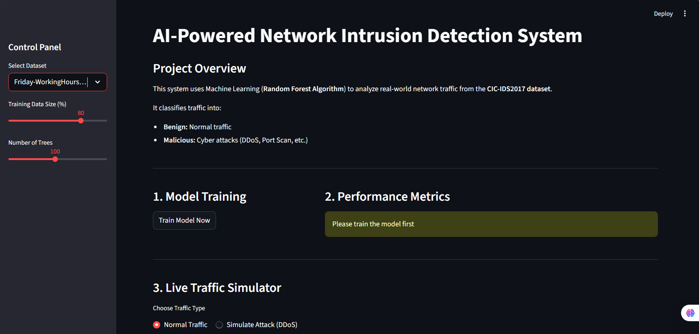
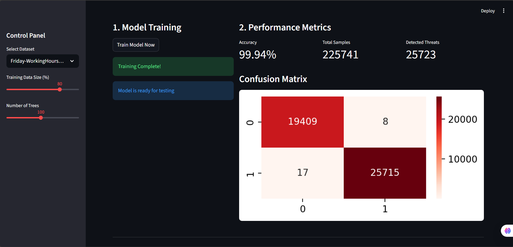
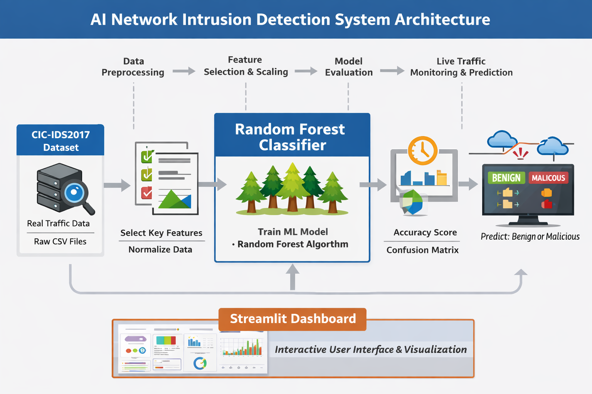

# 🚨 AI Network Intrusion Detection System (AI-NIDS)


An **AI-powered Network Intrusion Detection System (NIDS)** developed using **Machine Learning (Random Forest Algorithm)** to detect **malicious network traffic** from real-world datasets.  
The system is built using the **CIC-IDS2017 benchmark dataset** and provides an interactive **Streamlit-based dashboard** for analysis and prediction.

---

## 📌 Project Overview

With the rapid growth of network-based applications, cyberattacks such as **DDoS, Port Scans, and Infiltration attacks** have become more frequent.  
This project aims to identify such intrusions by learning traffic patterns from labeled network flow data and classifying them as **Benign** or **Malicious**.

The system follows a complete machine learning pipeline:
- Data loading from real network traffic logs  
- Data preprocessing and feature selection  
- Model training using Random Forest  
- Model evaluation using accuracy and confusion matrix  
- Live traffic prediction through a user interface

---

## 📸 Project Screenshots

Dashboard Overview  


Model Performance & Confusion Matrix  


Live Traffic Simulator  


---

## 🧠 System Architecture



1. **CIC-IDS2017 Dataset** (Raw CSV files)  
2. **Data Preprocessing** (Cleaning, normalization, feature selection)  
3. **Machine Learning Model** (Random Forest Classifier)  
4. **Model Evaluation** (Accuracy, Confusion Matrix)  
5. **Live Traffic Simulation & Prediction**  
6. **Streamlit Dashboard** for visualization and interaction  

---

## ✨ Key Features

- Real-world **CIC-IDS2017 dataset integration**
- Machine Learning–based intrusion detection
- Random Forest classifier for robust prediction
- Interactive Streamlit dashboard
- Accuracy and confusion matrix visualization
- Live traffic simulator for testing
- Support for multiple CIC dataset CSV files

---

## 🧰 Tech Stack

| Category | Technologies |
|--------|--------------|
| Programming Language | Python |
| Machineattach Learning | Random Forest (Scikit-learn) |
| Web Framework | Streamlit |
| Data Handling | Pandas, NumPy |
| Visualization | Matplotlib, Seaborn |  

---

## 📂 Dataset Information

- **Dataset Name:** CIC-IDS2017  
- **Provided By:** Canadian Institute for Cybersecurity (CIC), University of New Brunswick  
- **Official Dataset URL:**  
  https://www.unb.ca/cic/datasets/ids-2017.html  

**Note:**  
Due to the large size of the dataset files, CSV files are not included in this repository.  
Please download the dataset from the official source and place the required CSV files in the project root directory before running the application.

---

## ▶️ How to Run the Project

1. Clone the repository
   ```bash
   git clone https://github.com/SonuKumarAnalyst/AI-Network-Intrusion-Detection-System.git  

3. Navigate to the project directory
   ```bash
   cd AI-Network-Intrusion-Detection-System  

5. Install dependencies
   ```bash
   pip install -r requirements.txt  

7. Run the Streamlit application
   ```bash
   streamlit run nids_main.py  

---

## 📁 Project Structure

    AI-Network-Intrusion-Detection-System  
    │── Simulation  
    │   ├── nids_main.py
    │── Production
    │   │── nids_main.py
    │── requirements.txt  
    │── README.md  
    │── .gitignore  
    │── images  
    │   ├── dashboard.png  
    │   ├── metrics.png  
    │   ├── simulator.png  
    │   └── architecture.png  

---

## 🎓 Academic & Practical Use

This project is suitable for:
- BCA / MCA final year projects  
- Internship submissions  
- Machine Learning demonstrations  
- Cybersecurity coursework  
- Resume and portfolio projects  

---

## 🚀 Future Enhancements you can Try

- Feature importance visualization  
- Attack type classification (DDoS, Port Scan, etc.)  
- Deep Learning–based intrusion detection  
- Cloud deployment (Streamlit Cloud / AWS)  
- User authentication and role management  

---

## 👤 Author

**Sonu Kumar**  
Aspiring Data Analyst & Machine Learning Enthusiast  

GitHub: https://github.com/SonuKumarAnalyst  

---

## 📜 License

This project is licensed under the **MIT License**.
